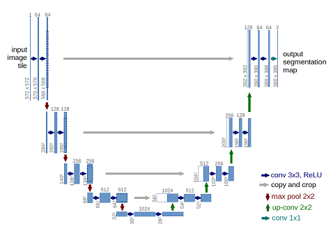
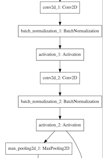
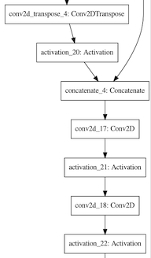
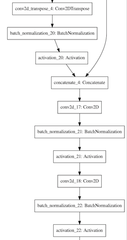
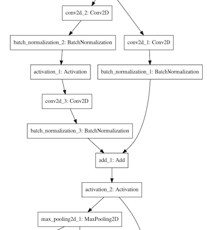
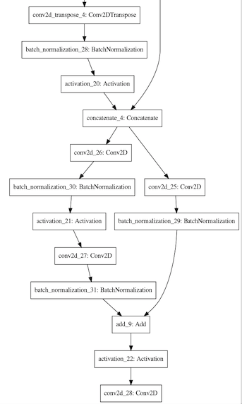
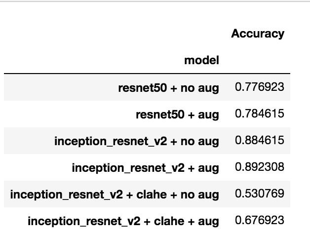

# BUS_Deep_Learning

This repository trains and implements a variety of convolutional neural network architectures designed for segmenting and classifying malignant and benign lesions in breast ultrasound images

**DATASET**

The data set was obtained from the following source:

https://scholar.cu.edu.eg/?q=afahmy/pages/dataset

The dataset contains 780 BUS images and their corresponding tumour masks. There are:
*437 images with benign tumours
*210 images with malignant tumours
*133 images with no tumours

The training/validation split was performed in a stratified manner with an 80/20 split with the following output:

Train
* 350 images with benign tumours
* 168 images with malignant tumours
* 106 images with no tumours

**624 images in total**

Validation
* 87 images with benign tumours
* 42 images with malignant tumours
* 27 images with no tumours

**156 images in total**

Preprocessing methods
*CLAHE
*Histogram Equalization
*Division of pixel values by 255

https://docs.opencv.org/master/d5/daf/tutorial_py_histogram_equalization.html

**SEG MODEL**

The base architecture used for comparitive purposes is a standard u-net architecture. The unet architecture contains a series of up and down blocks that function as a encoder-decoder network.

Various modification were then performed on the unet:

1- Batch Normalization layers were added after every convolutional block

2- Residual layers were added to both every up and down block and additional convolutional layers were added in the up blocks to manage the data flow through the paths of the residual layers

Additionally, experiments were run in which data augmentation was applied on the dataset before training. Specifally, horizontal and vertical shifts, shears and horizontal flipping was performed.

An Adam Optimizer was used for training all the models with a learning rate of 1e-4 and the stanard sigmoid loss was replaced with the dice loss commonly used in medical segmentation tasks.

Comparison between standard u-net (left) and u-net with batch normalization (right)

--> Down Block

u-net            |  u-net + batch norm
:-------------------------:|:-------------------------:
  |  

--> UpBlock

u-net            |  u-net + batch norm
:-------------------------:|:-------------------------:
  |  

Comparison between u-net with batch normalization (left) and res-unet with batch normalization (right)

--> Down Block

u-net + batch norm            |  res-unet + batch norm
:-------------------------:|:-------------------------:
 |  

--> UpBlock

u-net + batch norm            |  res-unet + batch norm
:-------------------------:|:-------------------------:
 |  

Additionally, a U-Net++, an ensemble network of unets, was used, details about which can be found here -->
https://arxiv.org/pdf/1912.05074.pdf

The U-Net++ was implemented using a inception resnet v2 backbone with the standard sigmoid loss replaced with dice loss.

Details about the exact configuration can be found on the official implementation github's repository, which was used in this study-->
https://github.com/MrGiovanni/UNetPlusPlus

**CLASSIFICATION MODEL**

A classification model that predicted whether a tumour was malignant or benign was trained as well using the following architectures. These were done with and without the augmentation techinques described above.

* resnet50
* inception resnet v2

**RESULTS**

**Segmentation**

Considerable imporovement was obtained over the standard u-net architecture

IOU 6.8% improvement from u-net with no augmentation and no batch normalization to res-unet with no augmentation and no batch normalization

Dice Loss 6.1% improvement from u-net with no augmentation and no batch normalization to res-unet with no augmentation and no batch normalization

**Classification**

**REFERENCES**

https://www.ncbi.nlm.nih.gov/pmc/articles/PMC6707567/#pone.0221535.ref022

https://bmcmedimaging.biomedcentral.com/articles/10.1186/s12880-019-0389-2

https://arxiv.org/pdf/1912.05074.pdf

https://arxiv.org/pdf/1911.07067.pdf

